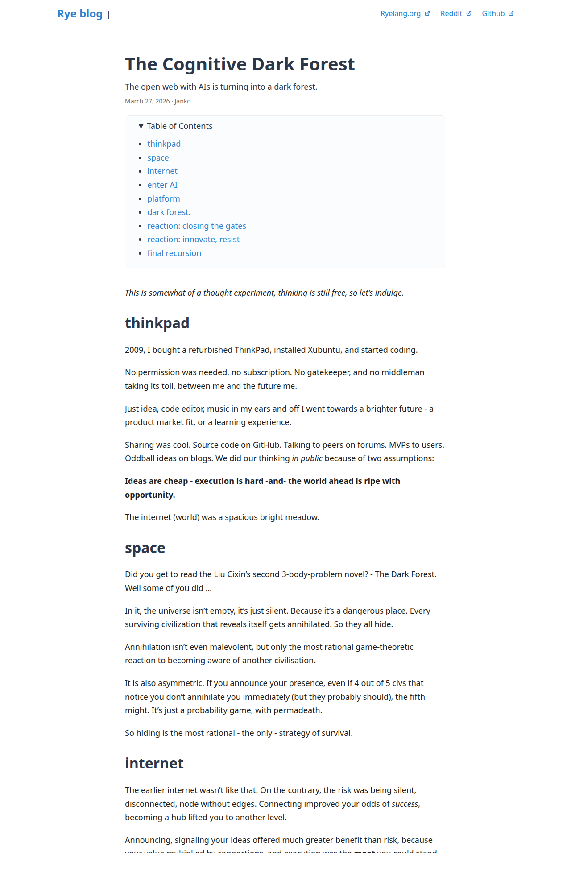

# The Cognitive Dark Forest

> The open web with AIs is turning into a dark forest.

*Source: [Rye blog](https://ryelang.org/blog/posts/cognitive-dark-forest/) | Author: Janko | Published: March 27, 2026*

## Summary

This essay draws from Liu Cixin's "Dark Forest" theory (from The Three-Body Problem trilogy) to describe how AI is fundamentally changing the dynamics of innovation and knowledge sharing on the internet.

### Core Argument

**The Bright Meadow (2009-era internet):**
- Ideas were shared openly because execution was the real moat
- The internet was spacious with abundant opportunity
- Sharing improved your odds of success
- Building in public had more benefits than risks

**The Cognitive Dark Forest (2026):**
- AI platforms can absorb any innovation almost instantly
- Every prompt reveals intent and feeds platform intelligence
- Big tech has compute, models, and developer data
- Innovation gets absorbed, differentiated into median
- The safest strategy becomes hiding

### Key Insights

1. **Surveillance by Statistics**: Platforms don't need to spy on individuals - they just need to see where questions cluster, creating a demand curve of human interests.

2. **The Absorption Paradox**: The act of resisting feeds the system. "Resistance isn't suppressed. It's absorbed. The very act of resisting feeds what you resist and makes it less fragile to future resistance."

3. **Recursive Trap**: Even warning about the forest feeds it. The essay itself becomes training data. "There is no outside."

### Sections

- **thinkpad**: The 2009 open internet era
- **space**: Liu Cixin's Dark Forest theory from The Three-Body Problem
- **internet**: How consolidation changed the game
- **enter AI**: Cheap execution through LLMs
- **platform**: How AI platforms harvest intent
- **dark forest**: The dangerous actor is the forest itself
- **reaction: closing the gates**: Return to private innovation
- **reaction: innovate, resist**: The futility of out-innovating the forest
- **final recursion**: Meta-commentary on the essay itself

## External Discussions

- [Tildes](https://tildes.net)
- [Hacker News](https://news.ycombinator.com)
- [Lobsters](https://lobste.rs)
- [r/BetterOffline](https://reddit.com/r/BetterOffline)

## Related Essays

- "The Cognitive Dark Forest: Why the Smartest People Online Are Going Silent"
- "The Forest Doesn't Kill You. It Trains On You."
- "The Cognitive Dark Forest Has One Exit: Become the Forest"
- "The Cognitive Dark Forest: How AI Platforms Will Weaponise Your Thinking"

---

*Archived: 2025-04-08*
