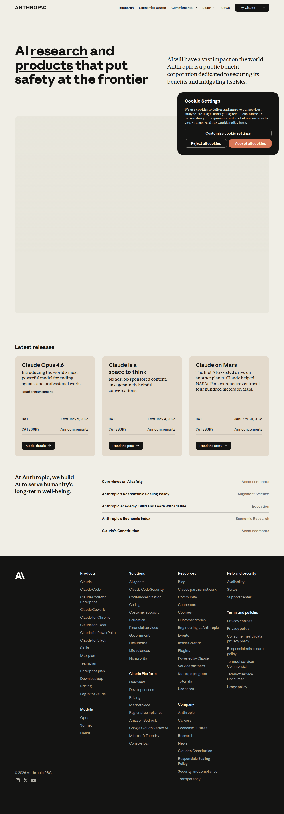

# Anthropic

> "AI research and products that put safety at the frontier" — Public benefit corporation building safe, steerable AI systems.

## Overview

Anthropic is an AI safety company and public benefit corporation founded in 2021 by former OpenAI researchers Dario and Daniela Amodei. They pioneered **Constitutional AI** and focus on developing reliable, interpretable, and steerable AI systems.

| Attribute | Value |
|-----------|-------|
| **Founded** | 2021 |
| **Founders** | Dario Amodei, Daniela Amodei |
| **HQ** | San Francisco, USA |
| **Type** | Public Benefit Corporation |
| **Key Differentiator** | AI safety, Constitutional AI, steerable systems |
| **API Format** | OpenAI-compatible |
| **Free Tier** | ✅ Yes (Claude.ai, API credits) |

## Claude Model Family

### Current Generation (Claude 3.5/3.7)

| Model | Context | Best For | Pricing Input | Pricing Output |
|-------|---------|----------|---------------|----------------|
| **Claude 3.7 Sonnet** | 200K | Coding, reasoning, agentic tasks | $3/M | $15/M |
| **Claude 3.5 Sonnet** | 200K | General purpose, fast | $3/M | $15/M |
| **Claude 3.5 Haiku** | 200K | Speed, cost-efficiency | $0.25/M | $1.25/M |

### Previous Generation

| Model | Status | Notes |
|-------|--------|-------|
| **Claude 3 Opus** | Legacy | Most powerful, expensive |
| **Claude 3 Sonnet** | Legacy | Balance of speed/capability |
| **Claude 3 Haiku** | Legacy | Fast, cost-effective |

### Model Capabilities

- **Vision**: All Claude 3.5 models process images
- **Tool Use**: Native function calling
- **Computer Use**: Claude can control computers (beta)
- **Extended Thinking**: Extended reasoning mode for complex problems

## Key Features

### Constitutional AI

Self-improvement technique where AI learns from constitutional principles rather than human feedback labels alone:
1. Generate responses
2. Critique based on constitution
3. Revise responses
4. Train on revised outputs

### Computer Use (Beta)

Claude can:
- View screens
- Move cursor
- Click buttons
- Type text
- Navigate interfaces

### Claude Artifacts

Side-panel workspace for:
- Code preview
- Document editing
- Interactive components

### Projects

Organize conversations and documents by project with shared context.

## API Quick Start

```python
import anthropic

client = anthropic.Anthropic(
    api_key="your-api-key"
)

response = client.messages.create(
    model="claude-3-5-sonnet-20241022",
    max_tokens=4096,
    messages=[{
        "role": "user",
        "content": "Hello, Claude!"
    }]
)
```

### OpenAI-compatible

```python
from openai import OpenAI

client = OpenAI(
    api_key="your-anthropic-api-key",
    base_url="https://api.anthropic.com/v1"
)

response = client.chat.completions.create(
    model="claude-3-5-sonnet-20241022",
    messages=[{"role": "user", "content": "Hello!"}]
)
```

## Safety & Alignment

### Responsible Scaling Policy

Commitments for managing increasingly capable AI systems:
- ASL-1: Basic safety
- ASL-2: Limited risk
- ASL-3: Serious risk thresholds
- ASL-4: Critical risk thresholds

### Claude's Constitution

Set of principles guiding Claude's behavior:
- Helpfulness
- Harmlessness
- Honesty

## Products

| Product | Description |
|---------|-------------|
| **Claude.ai** | Consumer chat interface (free/pro plans) |
| **Claude API** | Developer API access |
| **Claude Workbench** | Developer console for testing |
| **Claude for Enterprise** | Organization-wide deployment |

## Pricing Tiers

### Claude.ai

| Plan | Price | Features |
|------|-------|----------|
| Free | $0 | Limited messages, Claude 3.5 Sonnet only |
| Pro | $20/mo | 5x more usage, all models, priority access |
| Team | $25/user/mo | Shared workspaces, billing |
| Enterprise | Custom | SSO, audit logs, custom retention |

### API

Pay-per-token with volume discounts. See model table above for rates.

## Use Cases

- ✅ **Coding assistants** — Best-in-class code generation
- ✅ **Long-document analysis** — 200K context
- ✅ **Research synthesis** — Complex reasoning
- ✅ **Creative writing** — Nuanced, natural output
- ✅ **Customer support** — Reliable, safe responses
- ✅ **Agentic workflows** — Tool use, computer control

## Limitations

1. **No internet access** — Knowledge cutoff (training date)
2. **Image generation** — Can analyze but not create images
3. **Realtime audio** — Text only (no native voice mode)
4. **Geographic** — API not available in all regions

## Comparison

| vs | Anthropic Advantage | Trade-off |
|----|---------------------|-----------|
| **OpenAI** | Safety focus, steerability | Less multimodal |
| **Google** | Reliability, instruction following | Smaller context |
| **Meta** | Safety, alignment | Not open weights |

## Resources

- **Main**: https://anthropic.com
- **API Docs**: https://docs.anthropic.com
- **Claude.ai**: https://claude.ai
- **Constitution**: https://www.anthropic.com/research/constitutional-ai
- **Research**: https://www.anthropic.com/research

## Related

- [[openai|OpenAI]] — Alternative frontier provider
- [[groq|Groq]] — Fast Claude inference
- [[20-knowledge/ai/concepts/constitutional-ai|Constitutional AI]]
- [[20-knowledge/ai/concepts/ai-safety|AI Safety Patterns]]

---

*Last updated: 2026-04-05*
