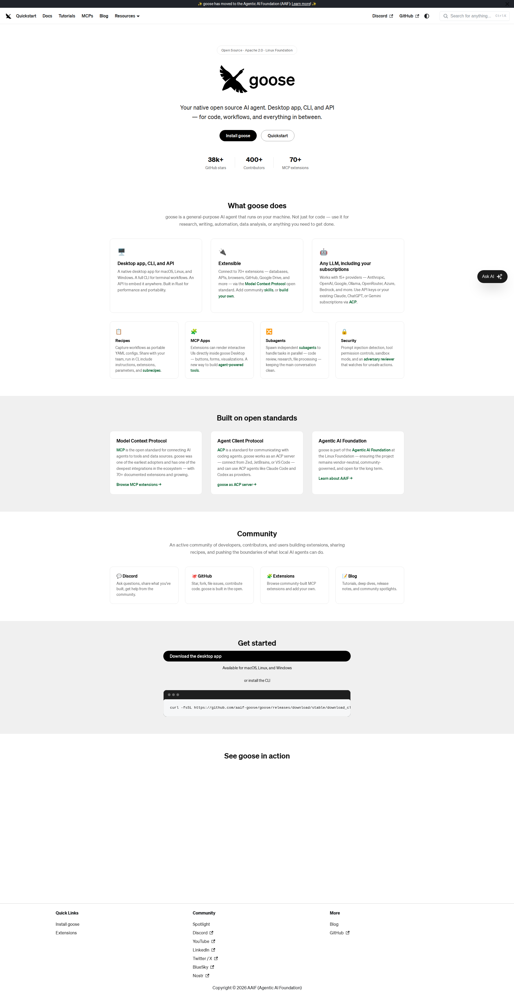

# Goose AI Agent

> "Your native open source AI agent. Desktop app, CLI, and API — for code, workflows, and everything in between."



## Overview

Goose is an **open-source, general-purpose AI agent** that runs locally on your machine. Unlike cloud-based assistants, Goose operates entirely on your hardware with support for multiple LLM providers. It's built in Rust for performance and recently moved to the **Agentic AI Foundation (AAIF)** at the Linux Foundation.

| Attribute | Value |
|-----------|-------|
| **Created** | 2024 |
| **License** | Apache 2.0 |
| **Organization** | Agentic AI Foundation (AAIF) |
| **Built with** | Rust |
| **GitHub Stars** | 38k+ |
| **Contributors** | 400+ |
| **MCP Extensions** | 70+ |

## Platforms

- **Desktop App**: macOS, Linux, Windows
- **CLI**: Full terminal interface
- **API**: Embeddable anywhere
- **ACP Server**: Works with Zed, JetBrains, VS Code

## Supported LLM Providers

Goose works with 15+ providers:

| Provider | Integration |
|----------|-------------|
| Anthropic | Claude models |
| OpenAI | GPT models |
| Google | Gemini |
| Ollama | Local models |
| OpenRouter | Multi-provider |
| Azure | Enterprise |
| Bedrock | AWS |
| ACP Agents | Claude Code, Codex |

Plus: Use existing subscriptions via ACP (Claude, ChatGPT, Gemini).

## Installation

### CLI
```bash
curl -fsSL https://github.com/aaif-goose/goose/releases/download/stable/download_cli.sh | bash
```

### Desktop
Download from [goose-docs.ai](https://goose-docs.ai/docs/getting-started/installation)

## Key Features

### 🤖 Multiple Interfaces
- Native desktop app
- Full CLI for terminal workflows  
- API for integration

### 🔌 Extensible (MCP)
Connect to 70+ extensions via **Model Context Protocol (MCP)**:
- Databases
- APIs
- Browsers
- GitHub
- Google Drive
- And more...

### 📋 Recipes
Capture workflows as portable YAML configs:
- Share with your team
- Run in CI
- Include instructions, extensions, parameters
- Subrecipe support

### 🧩 MCP Apps
Extensions can render interactive UIs inside Goose Desktop:
- Buttons
- Forms
- Visualizations

### 🔀 Subagents
Spawn independent subagents for parallel tasks:
- Code review
- Research
- File processing

### 🔒 Security
- Prompt injection detection
- Tool permission controls
- Sandbox mode
- Adversary reviewer for unsafe actions

## Built on Open Standards

### Model Context Protocol (MCP)
Open standard for connecting AI agents to tools and data sources. Goose was one of the earliest adopters with deep ecosystem integration.

### Agent Client Protocol (ACP)
Standard for communicating with coding agents:
- Goose works as an ACP server
- Connect from Zed, JetBrains, VS Code
- Can use ACP agents (Claude Code, Codex) as providers

### Agentic AI Foundation
Part of the Linux Foundation — vendor-neutral, community-governed.

## API Example

```bash
# Goose as ACP server
goose server

# Connect from VS Code, Zed, JetBrains
```

## Community Resources

- **Extensions**: [goose-docs.ai/extensions](https://goose-docs.ai/extensions)
- **Skills Marketplace**: [goose-docs.ai/skills](https://goose-docs.ai/skills)
- **Recipe Generator**: [goose-docs.ai/recipe-generator](https://goose-docs.ai/recipe-generator)
- **Prompt Library**: [goose-docs.ai/prompt-library](https://goose-docs.ai/prompt-library)
- **Recipe Cookbook**: [goose-docs.ai/recipes](https://goose-docs.ai/recipes)

## Community Links

- 💬 [Discord](https://discord.gg/goose-oss)
- 🐙 [GitHub](https://github.com/aaif-goose/goose)
- 📝 [Blog](https://goose-docs.ai/blog)
- 🐦 [Twitter/X](https://x.com/goose_oss)
- 💼 [LinkedIn](https://www.linkedin.com/company/goose-oss)
- 🎬 [YouTube](https://www.youtube.com/@goose-oss)
- 🦋 [BlueSky](https://bsky.app/profile/opensource.block.xyz)

## Comparison: Goose vs Other Agents

| Feature | Goose | Claude Code | Codex CLI |
|---------|-------|-------------|-----------|
| **License** | Apache 2.0 | Proprietary | Proprietary |
| **Local Execution** | ✅ Yes | ❌ No | ❌ No |
| **Desktop App** | ✅ Yes | ❌ No | ❌ No |
| **MCP Extensions** | 70+ | Limited | Limited |
| **Multi-Provider** | ✅ 15+ | Anthropic only | OpenAI only |
| **Subagents** | ✅ Yes | ✅ Yes | ✅ Yes |
| **Open Source** | ✅ Yes | ❌ No | ❌ No |

## Limitations

- Requires local setup/configuration
- Performance depends on chosen LLM provider
- Some features require specific providers
- Community-driven (less enterprise support than commercial alternatives)

## Related

- [GooseAI](goose-ai.md) — Different product (NLP API service)
- [MCP Specification](https://modelcontextprotocol.io/)
- [ACP Specification](https://agentclientprotocol.com/)
- [Agentic AI Foundation](https://aaif.io/)

---

*Last updated: 2026-04-09*
*Note: Project moved to AAIF on April 7, 2026*
