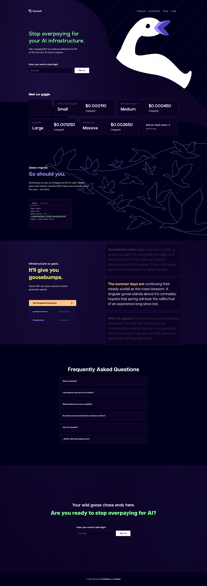

# GooseAI

> "Stop overpaying for your AI infrastructure" — Fully managed NLP-as-a-Service delivered via API, at 30% the cost.



## Overview

GooseAI is an **NLP-as-a-Service** provider offering fully managed language model inference via API. It's a joint venture between **CoreWeave** (GPU cloud infrastructure) and **Anlatan** (creators of NovelAI), designed to provide cost-effective access to open-source language models.

| Attribute | Value |
|-----------|-------|
| **Founded** | 2021 |
| **Parent Companies** | CoreWeave + Anlatan (NovelAI) |
| **API Type** | OpenAI-compatible |
| **Free Tier** | ❌ No (credit-based system) |
| **Key Differentiator** | Up to 70% cost savings vs competitors |
| **Twitter** | @gooseai_NLP |

## Pricing Model

GooseAI uses a **unique per-request pricing** model rather than per-token:

- **Base price** includes first 25 tokens generated
- **Additional tokens** charged per-token beyond 25
- You only pay for **output tokens**, not input tokens
- Credit-based pre-payment system
- Enterprise bulk discounts available

## Available Models

### 125M Parameters
| Model | Base Price (25 tokens) | Additional Token |
|-------|------------------------|------------------|
| GPT-Neo, Fairseq | $0.000035/request | $0.000001/token |

### 1.3B Parameters
| Model | Base Price (25 tokens) | Additional Token |
|-------|------------------------|------------------|
| GPT-Neo, Fairseq | $0.000110/request | $0.000003/token |

### 2.7B Parameters
| Model | Base Price (25 tokens) | Additional Token |
|-------|------------------------|------------------|
| GPT-Neo, Fairseq | $0.000300/request | $0.000008/token |

### 6B Parameters
| Model | Base Price (25 tokens) | Additional Token |
|-------|------------------------|------------------|
| GPT-J, Fairseq | $0.000450/request | $0.000012/token |

### 13B Parameters
| Model | Base Price (25 tokens) | Additional Token |
|-------|------------------------|------------------|
| Fairseq | $0.001250/request | $0.000036/token |

### 20B Parameters
| Model | Base Price (25 tokens) | Additional Token |
|-------|------------------------|------------------|
| GPT-NeoX | $0.002650/request | $0.000063/token |

## API Quick Start

```python
import openai

openai.api_key = "YOUR_GOOSEAI_API_KEY"
openai.api_base = "https://api.goose.ai/v1"

engines = openai.Engine.list()

response = openai.Completion.create(
    engine="gpt-neo-20b",
    prompt="Hello, world!",
    max_tokens=25
)
```

## Key Features

- ✅ OpenAI-compatible API (drop-in replacement)
- ✅ Only pay for output tokens (not input)
- ✅ Predictable per-request pricing
- ✅ Up to 2,048 tokens per generation
- ✅ Credit-based payment system
- ✅ 70% cost savings vs competitors

## Use Cases

- Text completion/generation
- Question answering (coming soon)
- Classification (coming soon)

## Comparison: Cost Savings

| Provider | Pricing Model | Typical Cost |
|----------|--------------|--------------|
| **GooseAI** | Per-request + output tokens | **70% less** |
| OpenAI | Per-token (input + output) | Baseline |
| Other APIs | Per-token (input + output) | Higher |

The key advantage: GooseAI doesn't charge for input tokens, giving you more control and predictable costs.

## Limitations

- No free tier (requires credit purchase)
- Smaller model selection compared to OpenAI
- Primarily focused on completion tasks
- No advanced features like function calling, vision, etc.
- Question answering and classification marked as "coming soon"

## Related

- [GooseAI Pricing](https://goose.ai/pricing)
- [CoreWeave](https://www.coreweave.com/) — GPU cloud infrastructure partner
- [NovelAI](https://novelai.net) — Anlatan's AI storytelling platform
- [Goose (Agent)](goose-agent.md) — Different product, open source AI agent

---

*Last updated: 2026-04-09*
