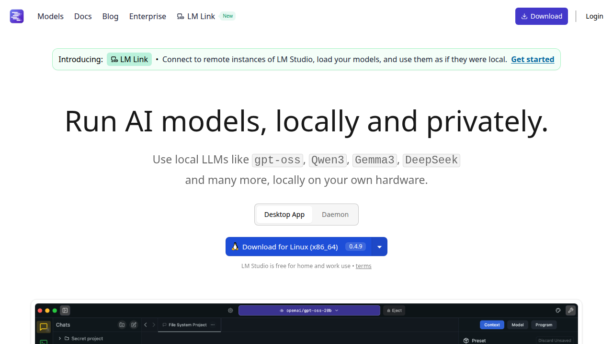

# LM Studio

> Run AI models, locally and privately — with a beautiful native GUI.



## Overview

LM Studio is a **desktop application** for running LLMs locally. Think of it as a user-friendly wrapper around llama.cpp with model discovery, chat UI, and an OpenAI-compatible local server.

| Attribute | Value |
|-----------|-------|
| **Type** | Desktop App (GUI) |
| **License** | Free for home and work |
| **Platforms** | macOS, Windows, Linux |
| **Key Differentiator** | Best-in-class GUI for local LLMs |
| **Backend** | llama.cpp |

## Features

### Model Discovery & Download

- Built-in HuggingFace browser
- Filter by architecture (Llama, Mistral, Qwen, etc.)
- One-click downloads
- Automatic quantization selection

### Chat Interface

- Multi-model chat (compare side-by-side)
- Persistent conversation history
- Markdown rendering
- Code highlighting
- System prompt presets

### Local Server

- OpenAI-compatible API endpoint
- Runs on `http://localhost:1234/v1`
- Configurable context length
- Multiple model loading

### llmster (Headless)

Deploy on servers without GUI:

```bash
# macOS / Linux
curl -fsSL https://lmstudio.ai/install.sh | bash

# Windows
irm https://lmstudio.ai/install.sh | iex
```

Perfect for:
- CI/CD pipelines
- Server deployments
- Docker containers
- API-only use cases

## Hardware Acceleration

| Platform | Acceleration |
|----------|--------------|
| Apple Silicon | Metal (MPS) |
| NVIDIA | CUDA |
| AMD | ROCm (Linux) |
| Intel | OpenVINO |

## Pros & Cons

| ✅ Pros | ❌ Cons |
|---------|---------|
| Beautiful, intuitive GUI | No CLI-first workflow |
| Easy model discovery | Less scriptable than Ollama |
| Great for beginners | Heavier resource usage |
| Side-by-side comparisons | |
| Built-in server mode | |

## Best For

- Users who prefer GUI over CLI
- Comparing multiple models
- Learning and experimentation
- Non-technical users

## Related

- [Website](https://lmstudio.ai)
- [Discord Community](https://discord.gg/aPQSR5qp)
- [Local LLM Tools Overview](../tools/local-llm-tools.md)

---

*Last updated: 2026-03-05*
