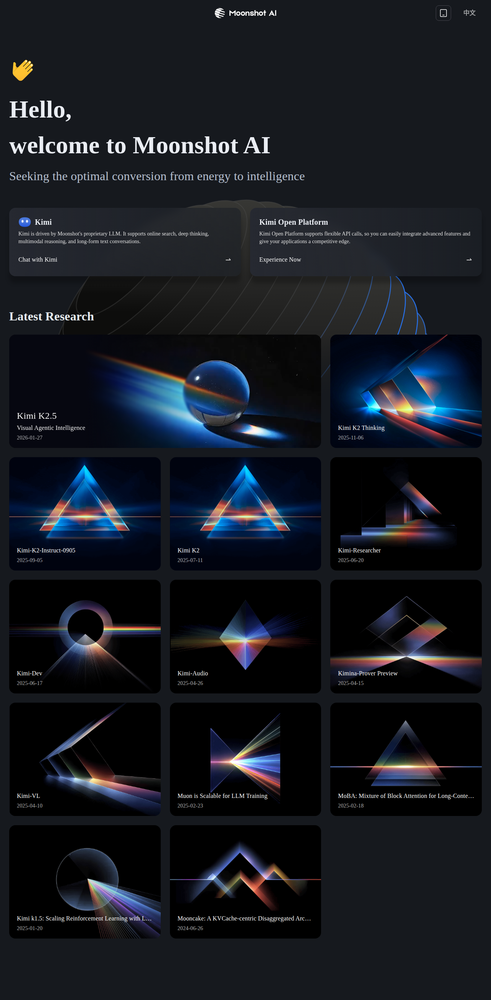

# Moonshot AI - Provider Analysis

## Überblick

Moonshot AI (月之暗面) ist ein chinesischer AI-Provider, spezialisiert auf Large Language Models mit extrem großen Kontext-Fenstern. Das Unternehmen wurde 2023 gegründet und hat sich durch die Kimi-Modellreihe einen Namen gemacht.

## Modelle

### Kimi K2.5

| Attribut | Spezifikation |
|----------|---------------|
| Kontext | 256K tokens (Standard) |
| Erweitert | 1M tokens (K2.5 1M) |
| Typ | Text-only / Multimodal |
| Stärken | Long-context, Reasoning |

### Kimi K1.6

| Attribut | Spezifikation |
|----------|---------------|
| Kontext | 2 Millionen+ tokens |
| Fokus | Ultra-long document processing |
| Use Case | Bücher, Codebases, Research |

### Kimi-Vision

- Multimodale Fähigkeiten
- Bild + Text Verarbeitung
- 256K Kontext

## Kontext-Fenster Vergleich

| Provider | Modell | Max Context |
|----------|--------|-------------|
| Moonshot | Kimi K1.6 | 2M+ tokens |
| Moonshot | Kimi K2.5 1M | 1M tokens |
| Anthropic | Claude 3.5 Sonnet | 200K tokens |
| OpenAI | GPT-4o | 128K tokens |
| Google | Gemini 1.5 Pro | 2M tokens |

Moonshot gehört damit zu den führenden Anbietern für Long-Context-Processing.

## API & Integration

### API-Format

OpenAI-kompatible API:

```bash
curl https://api.moonshot.cn/v1/chat/completions \
  -H "Authorization: Bearer $MOONSHOT_API_KEY" \
  -H "Content-Type: application/json" \
  -d '{
    "model": "kimi-k2.5",
    "messages": [{"role": "user", "content": "Hello!"}]
  }'
```

### Features

- Streaming Support
- Function Calling
- Reasoning/Thinking Mode
- JSON Mode
- Tool Use

### OpenClaw Integration

In OpenClaw über OpenRouter oder direkte Moonshot API:

```yaml
# models.json
{
  "id": "openrouter/moonshotai/kimi-k2.5",
  "name": "Kimi K2.5",
  "provider": "openrouter",
  "context": 256000
}
```

## Preise (geschätzt)

| Modell | Input | Output |
|--------|-------|--------|
| Kimi K2.5 | ~$0.50/M | ~$2.00/M |
| Kimi K2.5 1M | Premium | Premium |

*Preise variieren je nach Region und Vertragsmodell*

## Stärken

1. **Long Context**: Branchenführend bei Kontext-Fenstern
2. **Chinesisch**: Exzellente Performance in Mandarin
3. **Dokumenten-Verarbeitung**: Ideal für lange Texte
4. **Preis-Leistung**: Wettbewerbsfähig zu Western-Providern

## Limitationen

1. **Geografische Verfügbarkeit**: Primär China-fokussiert
2. **Englisch**: Gut, aber nicht Frontier-Level
3. **Dokumentation**: Weniger umfangreich als OpenAI/Anthropic
4. **Enterprise Support**: Weniger etabliert außerhalb Asiens

## Use Cases

### Ideal für
- Lange Dokumenten-Analyse
- Buch-Zusammenfassungen
- Codebase-Verarbeitung
- Forschungs-Paper Review
- Mehrstufige Konversationen

### Weniger geeignet
- Echtzeit-Anwendungen (niedrige Latenz)
- Primär englischsprachige Märkte
- Anwendungen mit strengen Compliance-Anforderungen (EU/US)

## Konkurrenz-Positionierung

```
Long Context
     │
 2M  │  ★ Gemini 1.5 Pro
     │  ★ Kimi K1.6
 1M  │  ★ Kimi K2.5 1M
     │
256K │  ★ Kimi K2.5
     │  ★ Claude 3.5 Sonnet
128K │  ★ GPT-4o
     │
     └─────────────────────
       Frontier Quality
```

## Resources

- Website: https://www.moonshot.ai/
- API Docs: https://platform.moonshot.cn/docs
- (Hauptsächlich auf Chinesisch verfügbar)

## Related

- [[20-knowledge/ai/models/kimi-k2.5|Kimi K2.5 Modell-Analyse]]
- [[20-knowledge/ai/concepts/long-context-llms|Long Context LLMs]]

---

*Erstellt: 2026-03-30*
*Hinweis: Begrenzte öffentliche Informationen verfügbar*
