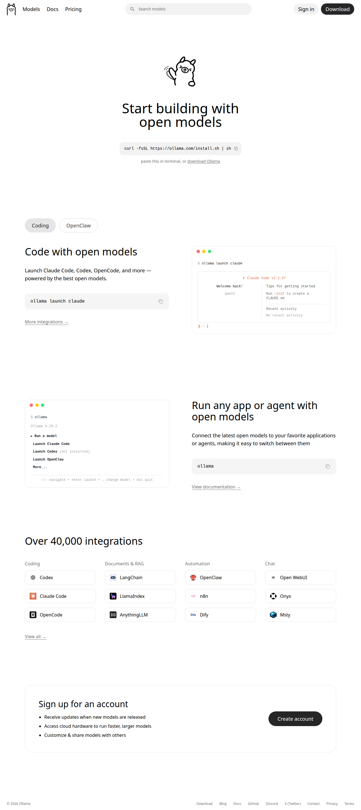

# Ollama

> Run Llama 3.3, DeepSeek-R1, Phi-4, Mistral, Gemma 3, and other models locally.



## Overview

Ollama is the **simplest way to run LLMs locally**. One command, no dependencies, works on macOS, Linux, and Windows. It bundles model weights, config, and data into a unified package managed by a Modelfile.

| Attribute | Value |
|-----------|-------|
| **Founded** | 2023 |
| **License** | MIT (open source) |
| **Price** | 100% Free |
| **Key Differentiator** | Dead-simple local LLM deployment |
| **GitHub Stars** | 100k+ |

## Installation

```bash
# macOS / Linux
curl -fsSL https://ollama.com/install.sh | sh

# Or download from https://ollama.com/download
```

## Quick Start

```bash
# Pull and run a model
ollama run llama3.1

# List available models
ollama list

# Pull a model without running
ollama pull deepseek-r1:14b

# Run with custom parameters
ollama run llama3.1 --verbose
```

## Popular Models (Library)

| Model | Sizes | Pulls | Features |
|-------|-------|-------|----------|
| **Llama 3.1** | 8B, 70B, 405B | 111M | Tools, general purpose |
| **DeepSeek-R1** | 1.5B - 671B | 79M | Reasoning, thinking |
| **Llama 3.2** | 1B, 3B | 59M | Edge devices, tools |
| **Gemma 3** | 270M - 27B | 33M | Vision, single GPU |
| **Qwen3** | 0.6B - 235B | 23M | MoE, multilingual |
| **Mistral** | 7B | 26M | Strong 7B baseline |
| **Phi-4** | 14B | 7M | Microsoft SOTA |
| **GPT-OSS** | 20B, 120B | 7M | OpenAI open weights |

### Categories

- **Text Models** — Llama, Mistral, Qwen, Phi
- **Code Models** — CodeLlama, Qwen2.5-Coder, DeepSeek Coder
- **Vision Models** — LLaVA, MiniCPM-V, Llama 3.2 Vision, Gemma 3
- **Embedding Models** — nomic-embed-text, mxbai-embed-large, bge-m3
- **Reasoning Models** — DeepSeek-R1 (chain-of-thought)

## Hardware Requirements

| Model Size | RAM Required | GPU VRAM (optional) |
|------------|--------------|---------------------|
| 1B - 3B | 4-6 GB | 2-4 GB |
| 7B - 8B | 8-10 GB | 6-8 GB |
| 14B - 13B | 16-20 GB | 12-16 GB |
| 32B - 70B | 40-80 GB | 24-48 GB |
| 405B+ | 256+ GB | 2x 80GB+ |

**Notes:**
- Quantized models (Q4, Q5, Q8) reduce VRAM needs by ~70%
- CPU inference works but is much slower
- Apple Silicon (M1/M2/M3) has excellent Metal support

## API & Integration

### REST API (built-in)

```bash
# Start the server
ollama serve

# Then query
curl http://localhost:11434/api/generate -d '{
  "model": "llama3.1",
  "prompt": "Why is the sky blue?"
}'
```

### OpenAI-compatible API

```bash
curl http://localhost:11434/v1/chat/completions -d '{
  "model": "llama3.1",
  "messages": [{"role": "user", "content": "Hello!"}]
}'
```

### OpenClaw Integration

Ollama integrates directly with OpenClaw for a personal AI assistant:

```bash
# Launch OpenClaw with Ollama
ollama launch openclaw

# Configure without launching
ollama launch openclaw --config

# Use specific model
ollama launch openclaw --model glm-4.7-flash
```

**Requirements:** 64k+ context window recommended for OpenClaw.

## Modelfile (Customization)

Create custom models with a `Modelfile`:

```dockerfile
FROM llama3.1

# Set parameters
PARAMETER temperature 0.7
PARAMETER top_p 0.9
PARAMETER num_ctx 8192

# System prompt
SYSTEM """You are a helpful coding assistant. 
Be concise, provide code examples."""
```

```bash
# Build custom model
ollama create my-assistant -f Modelfile

# Run it
ollama run my-assistant
```

## Advanced Features

| Feature | Command |
|---------|---------|
| **Multi-modal** | `ollama run llava` (vision) |
| **Code completion** | FIM (fill-in-middle) support |
| **Concurrent requests** | Built-in queue management |
| **Quantization** | Q4_0, Q4_K_M, Q5_K_M, Q8_0 |
| **Embeddings** | `ollama embed` endpoint |

## Configuration

```bash
# Environment variables
export OLLAMA_HOST=0.0.0.0:11434    # Bind address
export OLLAMA_MODELS=/path/to/models # Model storage
export OLLAMA_NUM_PARALLEL=4         # Parallel requests
export OLLAMA_MAX_LOADED_MODELS=2    # Models in memory
```

## Alternatives Comparison

| Tool | Complexity | Best For | GUI |
|------|------------|----------|-----|
| **Ollama** | ⭐ Dead simple | Quick start, scripting | No (CLI only) |
| **llama.cpp** | ⭐⭐ Moderate | Power users, optimization | Web UI |
| **LM Studio** | ⭐⭐ Moderate | GUI lovers, model discovery | ✅ Native |
| **LocalAI** | ⭐⭐⭐ Complex | API compatibility, Docker | No |
| **GPT4All** | ⭐⭐ Moderate | Desktop users, privacy | ✅ Native |

## Use Cases

- ✅ **Private AI** — Data never leaves your machine
- ✅ **Offline development** — No internet required
- ✅ **Cost savings** — No API fees
- ✅ **Experimentation** — Try models before cloud deployment
- ✅ **Custom agents** — Build with OpenClaw + local models

## Security & Privacy

- 🔒 Models downloaded to local storage only
- 🔒 No telemetry or tracking (opt-in anonymous stats)
- 🔒 Open source — audit the code
- 🔒 No cloud dependencies for inference

## Related

- [Ollama Library](https://ollama.com/library) — Browse all models
- [GitHub](https://github.com/ollama/ollama) — Source code
- [Modelfile docs](https://github.com/ollama/ollama/blob/main/docs/modelfile.md)
- [OpenClaw Integration](https://docs.ollama.com/integrations/openclaw)

---

*Last updated: 2026-03-05*
