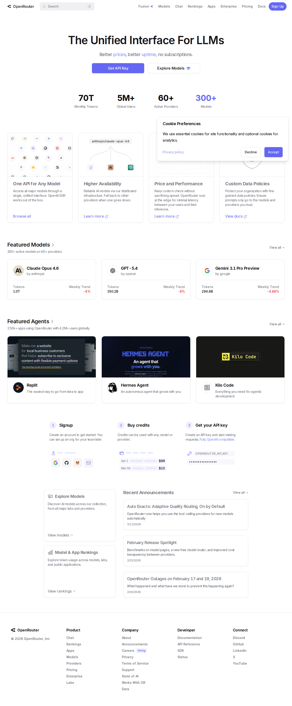

# OpenRouter

OpenRouter is useful as a routing layer when one client surface should access many providers and models through an OpenAI-compatible interface.

## Why it matters in this vault

- central place to compare and switch models
- useful abstraction when tools should stay provider-flexible
- makes model metadata and cost surfaces easier to inspect

## Best use in this vault

- broker access for experiments across providers
- stable API surface for scripts and agent runtimes
- model discovery when a project needs to swap providers without rewriting the client flow

## Caveat

OpenRouter is a transport and routing layer, not a substitute for provider-specific knowledge. Stable learnings about provider behavior still belong in provider notes.

## Related

- [[20-knowledge/ai/models/perplexity-sonar-deep-research]]
- [[20-knowledge/ai/providers/perplexity]]
- [[10-notes/40-resources/ai/2026-03-29-agentic-ai-source-pack]]

