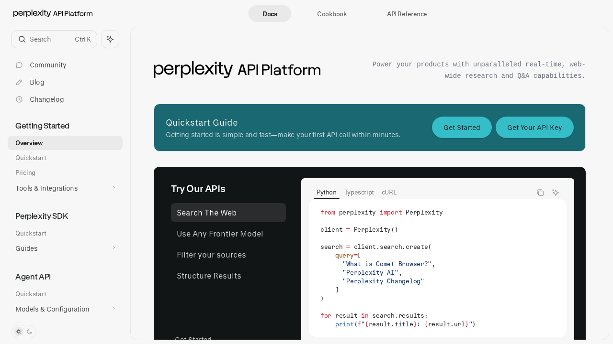

# Perplexity

Perplexity is relevant here as a research-oriented AI provider with separate surfaces for search retrieval, grounded answers, and more agentic workflows.

## Why it matters in this vault

- Good fit for source-grounded research capture before distillation
- Useful when agents need live web evidence instead of relying on stale notes
- Supports a clean split between raw retrieval and reusable knowledge notes

## API role split

### Search API

Use when the goal is to harvest ranked web results and extracted content with control over domains, region, and result handling.

Vault use:
- source collection
- domain-scoped research
- evidence gathering before synthesis

### Sonar / answer generation

Use when the goal is a grounded answer rather than raw search output.

Vault use:
- quick cited summaries
- compact research memos
- user-facing answers with source grounding

### Agentic workflows

Use when the task needs multi-step research or tool-using behavior instead of a single retrieval round.

Vault use:
- more exhaustive investigations
- complex comparison work
- topic exploration that should later be distilled into `20-knowledge/ai/`

## Recommended placement pattern

1. Save first-pass research in `10-notes/40-resources/ai/`
2. Distill stable provider knowledge here
3. Link project-specific usage back from the relevant project folder

## Related

- [[20-knowledge/ai/models/perplexity-sonar-deep-research]]
- [[20-knowledge/ai/concepts/agentic-research-knowledge-workflows]]
- [[10-notes/40-resources/ai/2026-03-29-agentic-ai-source-pack]]

